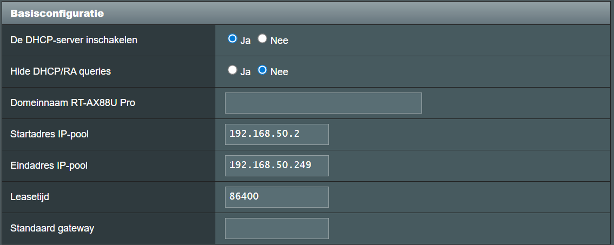
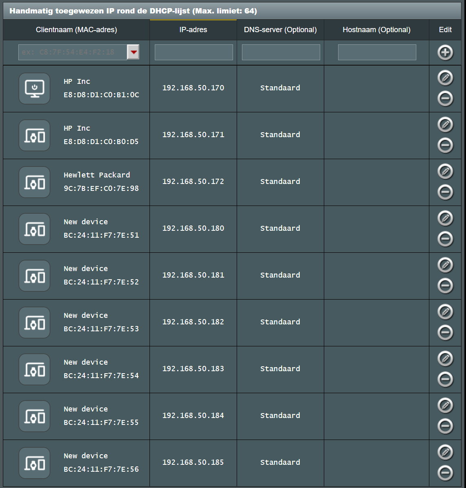

# Talos

Following is an (ad-hoc) manual to run bigbang on Proxmox/Talos

## Hardware setup
### Proxmox hosts
```
HW:
  p1: i5(6vcpu)|256(nvme)|512(ssd)|32GB
    ctl1: 192.168.50.180|BC:24:11:F7:7E:11|6vcpu|32GB(nvme)|8GB
    wrk1: 192.168.50.183|BC:24:11:F7:7E:12|6vcpu|32GB(nvme)|240(ssd)|12GB(12288)
    wrk2: 192.168.50.184|BC:24:11:F7:7E:13|6vcpu|32GB(nvme)|240(ssd)|12GB(12288)

  p2: i5(6vcpu)|256(nvme)|512(ssd)|40GB
    ctl2: 192.168.50.181|BC:24:11:F7:7E:21|6vcpu|32GB(nvme)|8GB
    wrk3: 192.168.50.185|BC:24:11:F7:7E:22|6vcpu|32GB(nvme)|240(ssd)|16GB(16384)
    wrk4: 192.168.50.186|BC:24:11:F7:7E:23|6vcpu|32GB(nvme)|240(ssd)|16GB

  p3: i5(6vcpu)|256(nvme)|512(ssd)|40GB
    ctl3: 192.168.50.182|BC:24:11:F7:7E:31|6vcpu|32GB(nvme)|8GB
    wrk5: 192.168.50.187|BC:24:11:F7:7E:32|6vcpu|32GB(nvme)|240(ssd)|16GB
    wrk6: 192.168.50.188|BC:24:11:F7:7E:33|6vcpu|32GB(nvme)|240(ssd)|16GB
```
### DHCP

Enable DHCP (excluding a cidr for load-balancing)


Assign fixed addresses to the hosts and vm's


## Proxmox

Shell into the proxmox node (one-by-one) using the gui and create the vm's

### Host P1
```
export BRIDGE=vmbr0
export VM_CTL1_NAME=bb9-ctl1
export VM_WRK1_NAME=bb9-wrk1
export VM_WRK2_NAME=bb9-wrk2
export VM_CTL1_ID=201
export VM_WRK1_ID=202
export VM_WRK2_ID=203

pvesm alloc local-lvm $VM_CTL1_ID vm-${VM_CTL1_ID}-disk-0 32G
pvesm alloc local-lvm $VM_WRK1_ID vm-${VM_WRK1_ID}-disk-0 32G
pvesm alloc local-lvm $VM_WRK2_ID vm-${VM_WRK2_ID}-disk-0 32G
pvesm alloc data $VM_WRK1_ID vm-${VM_WRK1_ID}-disk-1 240G
pvesm alloc data $VM_WRK2_ID vm-${VM_WRK2_ID}-disk-1 240G

qm create ${VM_CTL1_ID} \
  --agent 1 \
  --ide2 local:iso/metal-amd64.iso,media=cdrom,size=308556K \
  --name ${VM_CTL1_NAME} \
  --net0 virtio=BC:24:11:F7:7E:11,bridge=${BRIDGE},firewall=1 \
  --scsi0 local-lvm:vm-${VM_CTL1_ID}-disk-0,size=32G \
  --scsihw virtio-scsi-pci \
  --ostype l26 \
  --machine q35 \
  --memory 8192 \
  --onboot no \
  --sockets 1 \
  --cpu x86-64-v3 \
  --cores 6 \
  --boot "order=scsi0;ide2;net0" \
  --numa 0

qm create ${VM_WRK1_ID} \
  --agent 1 \
  --ide2 local:iso/metal-amd64.iso,media=cdrom,size=308556K \
  --name ${VM_WRK1_NAME} \
  --net0 virtio=BC:24:11:F7:7E:12,bridge=${BRIDGE},firewall=1 \
  --scsi0 local-lvm:vm-${VM_WRK1_ID}-disk-0,size=32G \
  --scsi1 data:vm-${VM_WRK1_ID}-disk-1,discard=on,size=240G \
  --scsihw virtio-scsi-pci \
  --ostype l26 \
  --machine q35 \
  --memory 12288 \
  --onboot no \
  --sockets 1 \
  --cpu x86-64-v3 \
  --cores 6 \
  --boot "order=scsi0;ide2;net0" \
  --numa 0

qm create ${VM_WRK2_ID} \
  --agent 1 \
  --ide2 local:iso/metal-amd64.iso,media=cdrom,size=308556K \
  --name ${VM_WRK2_NAME} \
  --net0 virtio=BC:24:11:F7:7E:13,bridge=${BRIDGE},firewall=1 \
  --scsi0 local-lvm:vm-${VM_WRK2_ID}-disk-0,size=32G \
  --scsi1 data:vm-${VM_WRK2_ID}-disk-1,discard=on,size=240G \
  --scsihw virtio-scsi-pci \
  --ostype l26 \
  --machine q35 \
  --memory 12288 \
  --onboot no \
  --sockets 1 \
  --cpu x86-64-v3 \
  --cores 6 \
  --boot "order=scsi0;ide2;net0" \
  --numa 0

qm start ${VM_CTL1_ID}
qm start ${VM_WRK1_ID}
qm start ${VM_WRK2_ID}

qm agent ${VM_CTL1_ID} network-get-interfaces
qm agent ${VM_WRK1_ID} network-get-interfaces
qm agent ${VM_WRK2_ID} network-get-interfaces
<...>
qm stop ${VM_CTL1_ID}
qm destroy ${VM_CTL1_ID}
qm stop ${VM_WRK1_ID}
qm destroy ${VM_WRK1_ID}
qm stop ${VM_WRK2_ID}
qm destroy ${VM_WRK2_ID}
```

### Host P2
```
export BRIDGE=vmbr0
export VM_CTL2_NAME=bb9-ctl2
export VM_WRK3_NAME=bb9-wrk3
export VM_WRK4_NAME=bb9-wrk4
export VM_CTL2_ID=204
export VM_WRK3_ID=205
export VM_WRK4_ID=206

pvesm alloc local-lvm $VM_CTL2_ID vm-${VM_CTL2_ID}-disk-0 32G
pvesm alloc local-lvm $VM_WRK3_ID vm-${VM_WRK3_ID}-disk-0 32G
pvesm alloc local-lvm $VM_WRK4_ID vm-${VM_WRK4_ID}-disk-0 32G
pvesm alloc data $VM_WRK3_ID vm-${VM_WRK3_ID}-disk-1 240G
pvesm alloc data $VM_WRK4_ID vm-${VM_WRK4_ID}-disk-1 240G

qm create ${VM_CTL2_ID} \
  --agent 1 \
  --ide2 local:iso/metal-amd64.iso,media=cdrom,size=308556K \
  --name ${VM_CTL2_NAME} \
  --net0 virtio=BC:24:11:F7:7E:21,bridge=${BRIDGE},firewall=1 \
  --scsi0 local-lvm:vm-${VM_CTL2_ID}-disk-0,size=32G \
  --scsihw virtio-scsi-pci \
  --ostype l26 \
  --machine q35 \
  --memory 8192 \
  --onboot no \
  --sockets 1 \
  --cpu x86-64-v3 \
  --cores 6 \
  --boot "order=scsi0;ide2;net0" \
  --numa 0

qm create ${VM_WRK3_ID} \
  --agent 1 \
  --ide2 local:iso/metal-amd64.iso,media=cdrom,size=308556K \
  --name ${VM_WRK3_NAME} \
  --net0 virtio=BC:24:11:F7:7E:22,bridge=${BRIDGE},firewall=1 \
  --scsi0 local-lvm:vm-${VM_WRK3_ID}-disk-0,size=32G \
  --scsi1 data:vm-${VM_WRK3_ID}-disk-1,discard=on,size=240G \
  --scsihw virtio-scsi-pci \
  --ostype l26 \
  --machine q35 \
  --memory 14336 \
  --onboot no \
  --sockets 1 \
  --cpu x86-64-v3 \
  --cores 6 \
  --boot "order=scsi0;ide2;net0" \
  --numa 0

qm create ${VM_WRK4_ID} \
  --agent 1 \
  --ide2 local:iso/metal-amd64.iso,media=cdrom,size=308556K \
  --name ${VM_WRK4_NAME} \
  --net0 virtio=BC:24:11:F7:7E:23,bridge=${BRIDGE},firewall=1 \
  --scsi0 local-lvm:vm-${VM_WRK4_ID}-disk-0,size=32G \
  --scsi1 data:vm-${VM_WRK4_ID}-disk-1,discard=on,size=240G \
  --scsihw virtio-scsi-pci \
  --ostype l26 \
  --machine q35 \
  --memory 14336 \
  --onboot no \
  --sockets 1 \
  --cpu x86-64-v3 \
  --cores 6 \
  --boot "order=scsi0;ide2;net0" \
  --numa 0

qm start ${VM_CTL2_ID}
qm start ${VM_WRK3_ID}
qm start ${VM_WRK4_ID}

qm agent ${VM_CTL2_ID} network-get-interfaces
qm agent ${VM_WRK3_ID} network-get-interfaces
qm agent ${VM_WRK4_ID} network-get-interfaces
<...>
qm stop ${VM_CTL2_ID}
qm destroy ${VM_CTL2_ID}
qm stop ${VM_WRK3_ID}
qm destroy ${VM_WRK3_ID}
qm stop ${VM_WRK4_ID}
qm destroy ${VM_WRK4_ID}
```

### Host P3
```
export BRIDGE=vmbr0
export VM_CTL3_NAME=bb9-ctl3
export VM_WRK5_NAME=bb9-wrk5
export VM_WRK6_NAME=bb9-wrk6
export VM_CTL3_ID=207
export VM_WRK5_ID=208
export VM_WRK6_ID=209

pvesm alloc local-lvm $VM_CTL3_ID vm-${VM_CTL3_ID}-disk-0 32G
pvesm alloc local-lvm $VM_WRK5_ID vm-${VM_WRK5_ID}-disk-0 32G
pvesm alloc local-lvm $VM_WRK6_ID vm-${VM_WRK6_ID}-disk-0 32G
pvesm alloc data $VM_WRK5_ID vm-${VM_WRK5_ID}-disk-1 240G
pvesm alloc data $VM_WRK6_ID vm-${VM_WRK6_ID}-disk-1 240G

qm create ${VM_CTL3_ID} \
  --agent 1 \
  --ide2 local:iso/metal-amd64.iso,media=cdrom,size=308556K \
  --name ${VM_CTL3_NAME} \
  --net0 virtio=BC:24:11:F7:7E:31,bridge=${BRIDGE},firewall=1 \
  --scsi0 local-lvm:vm-${VM_CTL3_ID}-disk-0,size=32G \
  --scsihw virtio-scsi-pci \
  --ostype l26 \
  --machine q35 \
  --memory 8192 \
  --onboot no \
  --sockets 1 \
  --cpu x86-64-v3 \
  --cores 6 \
  --boot "order=scsi0;ide2;net0" \
  --numa 0

qm create ${VM_WRK5_ID} \
  --agent 1 \
  --ide2 local:iso/metal-amd64.iso,media=cdrom,size=308556K \
  --name ${VM_WRK5_NAME} \
  --net0 virtio=BC:24:11:F7:7E:32,bridge=${BRIDGE},firewall=1 \
  --scsi0 local-lvm:vm-${VM_WRK5_ID}-disk-0,size=32G \
  --scsi1 data:vm-${VM_WRK5_ID}-disk-1,discard=on,size=240G \
  --scsihw virtio-scsi-pci \
  --ostype l26 \
  --machine q35 \
  --memory 16384 \
  --onboot no \
  --sockets 1 \
  --cpu x86-64-v3 \
  --cores 6 \
  --boot "order=scsi0;ide2;net0" \
  --numa 0

qm create ${VM_WRK6_ID} \
  --agent 1 \
  --ide2 local:iso/metal-amd64.iso,media=cdrom,size=308556K \
  --name ${VM_WRK6_NAME} \
  --net0 virtio=BC:24:11:F7:7E:33,bridge=${BRIDGE},firewall=1 \
  --scsi0 local-lvm:vm-${VM_WRK6_ID}-disk-0,size=32G \
  --scsi1 data:vm-${VM_WRK6_ID}-disk-1,discard=on,size=240G \
  --scsihw virtio-scsi-pci \
  --ostype l26 \
  --machine q35 \
  --memory 16384 \
  --onboot no \
  --sockets 1 \
  --cpu x86-64-v3 \
  --cores 6 \
  --boot "order=scsi0;ide2;net0" \
  --numa 0

qm start ${VM_CTL3_ID}
qm start ${VM_WRK5_ID}
qm start ${VM_WRK6_ID}

qm agent ${VM_CTL3_ID} network-get-interfaces
qm agent ${VM_WRK5_ID} network-get-interfaces
qm agent ${VM_WRK6_ID} network-get-interfaces
<...>
qm stop ${VM_CTL3_ID}
qm destroy ${VM_CTL3_ID}
qm stop ${VM_WRK5_ID}
qm destroy ${VM_WRK5_ID}
qm stop ${VM_WRK6_ID}
qm destroy ${VM_WRK6_ID}
```

## Bootstrap Talos (Kubernetes)

```
export CTL1_IP=192.168.50.180
export CTL2_IP=192.168.50.181
export CTL3_IP=192.168.50.182
export WRK1_IP=192.168.50.183
export WRK2_IP=192.168.50.184
export WRK3_IP=192.168.50.185
export WRK4_IP=192.168.50.186
export WRK5_IP=192.168.50.187
export WRK6_IP=192.168.50.188

talosctl get disks --nodes $CTL1_IP --insecure
talosctl get disks --nodes $WRK1_IP --insecure

talosctl gen config \
  bb9 \
  https://$CTL1_IP:6443 \
  --output-dir ./talos \
  --config-patch @./talos/config-patch.yaml \
  --config-patch-control-plane @./talos/config-patch-control-plane.yaml \
  --install-image factory.talos.dev/metal-installer/ce4c980550dd2ab1b17bbf2b08801c7eb59418eafe8f279833297925d67c7515:v1.12.6 \
  --force

talosctl apply-config --nodes $CTL1_IP --file ./talos/controlplane.yaml --config-patch @./talos/config-patch-ctl1.yaml --insecure
talosctl apply-config --nodes $CTL2_IP --file ./talos/controlplane.yaml --config-patch @./talos/config-patch-ctl2.yaml --insecure
talosctl apply-config --nodes $CTL3_IP --file ./talos/controlplane.yaml --config-patch @./talos/config-patch-ctl3.yaml --insecure
talosctl apply-config --nodes $WRK1_IP --file ./talos/worker.yaml --config-patch @./talos/config-patch-wrk1.yaml --insecure
talosctl apply-config --nodes $WRK2_IP --file ./talos/worker.yaml --config-patch @./talos/config-patch-wrk2.yaml --insecure
talosctl apply-config --nodes $WRK3_IP --file ./talos/worker.yaml --config-patch @./talos/config-patch-wrk3.yaml --insecure
talosctl apply-config --nodes $WRK4_IP --file ./talos/worker.yaml --config-patch @./talos/config-patch-wrk4.yaml --insecure
talosctl apply-config --nodes $WRK5_IP --file ./talos/worker.yaml --config-patch @./talos/config-patch-wrk5.yaml --insecure
talosctl apply-config --nodes $WRK6_IP --file ./talos/worker.yaml --config-patch @./talos/config-patch-wrk6.yaml --insecure

talosctl apply-config --nodes $CTL1_IP --file ./talos/controlplane.yaml --config-patch @./talos/config-patch-ctl1.yaml
talosctl apply-config --nodes $CTL2_IP --file ./talos/controlplane.yaml --config-patch @./talos/config-patch-ctl2.yaml
talosctl apply-config --nodes $CTL3_IP --file ./talos/controlplane.yaml --config-patch @./talos/config-patch-ctl3.yaml

<!-- for idx in `seq 1 6`; do
  talosctl apply-config --nodes $idx --file ./talos/worker.yaml --config-patch @./talos/config-patch-wrk1.yaml
done -->
talosctl apply-config --nodes $WRK1_IP --file ./talos/worker.yaml --config-patch @./talos/config-patch-wrk1.yaml
talosctl apply-config --nodes $WRK2_IP --file ./talos/worker.yaml --config-patch @./talos/config-patch-wrk2.yaml
talosctl apply-config --nodes $WRK3_IP --file ./talos/worker.yaml --config-patch @./talos/config-patch-wrk3.yaml
talosctl apply-config --nodes $WRK4_IP --file ./talos/worker.yaml --config-patch @./talos/config-patch-wrk4.yaml
talosctl apply-config --nodes $WRK5_IP --file ./talos/worker.yaml --config-patch @./talos/config-patch-wrk5.yaml
talosctl apply-config --nodes $WRK6_IP --file ./talos/worker.yaml --config-patch @./talos/config-patch-wrk6.yaml

export TALOSCONFIG="./talos/talosconfig"
talosctl config endpoint $CTL1_IP $CTL2_IP $CTL3_IP
talosctl config node $CTL1_IP $CTL2_IP $CTL3_IP
talosctl bootstrap --nodes $CTL1_IP

# Fetch kube config and merge into default + a fixed location for bb to pickup
talosctl kubeconfig --merge --nodes $CTL1_IP
talosctl kubeconfig --merge --nodes $CTL1_IP ~/.kube/bb9-dev-quickstart-config
```

## Install CNI
```
# Install the CNI (Calico because we need nwpols /w ipBlock support for BB)
kubectl apply --kustomize ./talos/calico/
# Run twice for the crds
kubectl apply --kustomize ./talos/calico/
```

## Storage (Block, fs, s3) using Rook / Ceph
```
helm repo add rook-release https://charts.rook.io/release
helm upgrade --install --create-namespace --namespace rook-ceph rook-ceph --values ./talos/ceph/rook-ceph.yaml rook-release/rook-ceph
# helm template --namespace rook-ceph rook-ceph --values ./talos/ceph/rook-ceph.yaml rook-release/rook-ceph --debug --output-dir ./debug/out.rook-ceph
helm plugin install ./talos/ceph/kustomize-ceph-plugin
# kubectl label namespace rook-ceph pod-security.kubernetes.io/enforce=privileged
helm upgrade --install --create-namespace --namespace rook-ceph rook-ceph-cluster --values ./talos/ceph/rook-ceph-cluster.yaml rook-release/rook-ceph-cluster --post-renderer kustomization-ceph --debug
# helm template --namespace rook-ceph rook-ceph-cluster --values ./talos/ceph/rook-ceph-cluster.yaml rook-release/rook-ceph-cluster --post-renderer kustomization-ceph --debug --output-dir ./debug/out.rook-ceph-cluster
```

## DNS Server (bind9) for static .mil addresses
```
helm repo add unxwares https://helm.unxwares.studio
helm plugin install ./talos/bind9/kustomize-bind9-plugin
helm upgrade --install --create-namespace --namespace bind9 bind9 --values ./talos/bind9/values.yaml unxwares/bind9 --post-renderer kustomization-bind9 --debug
helm template --namespace bind9 bind9 --values ./talos/bind9/values.yaml unxwares/bind9 --post-renderer kustomization-bind9 --debug --output-dir ./debug/out.bind9
```

## Load balancer using Metallb
```
helm repo add metallb https://metallb.github.io/metallb
helm repo update

# Install MetalLB
helm install metallb metallb/metallb \
  --namespace metallb-system \
  --create-namespace
# kubectl label namespace metallb-system pod-security.kubernetes.io/enforce=privileged
kubectl apply -f ./talos/metallb/metallb-l2-config.yaml
kubectl get ipaddresspool -n metallb-system

# Ceph UI can be found at: https://192.168.50.250:8443/#/login
# User=admin and Password can be found here: 
#    kubectl -n rook-ceph get secret rook-ceph-dashboard-password -o jsonpath="{['data']['password']}" | base64 --decode && echo
```

## Decommission a node

Decommissioning a node on the talos setup (/w Ceph running on workers) is not trivial, follow these steps for safe decommissioning a node.

1. Check Ceph cluster health

Within the ceph toolbox pod, run following:
```
$ ceph --status
cluster:
  health: HEALTH_OK
```

2. Take OSD's for the node out one-by-one

Use the Ceph dashboard to identify the OSD's running on the node and take them out 1-by-1:
```
$ ceph osd out osd.<X>
marked out osd.<X>.
```

3. Wait untill all PG's are `active+clean`
```
$ ceph --watch
  data:
    pgs:     489 active+clean
```

4. Drain and stop the node using Talos

```
$ talosctl -n $WRK<X>_IP reset
watching nodes: [192.168.50.188]
    * 192.168.50.188: events check condition met
```

5. Remove the node from Kubernetes

```
$ kubectl delete node talos-wrk<X>
node "talos-wrk<X>" deleted
```

6. Remove the node from Proxmox

Run following in a shell on the host
```
root@p3:~# qm destroy ${VM_WRK<X>_ID}
  Logical volume "vm-209-disk-0" successfully removed.
  Logical volume "vm-209-disk-1" successfully removed.
```

7. Purge the OSD

On the Ceph toolbox remove the OSD from the administration.
```
$ ceph osd purge <X> --yes-i-really-mean-it
purged osd.<X>
```

## Commission a node

Just create a new node (on Proxmox) and boot into Talos. Then push the config to tell it to join the cluster. After some minutes the node will popup in Kubernetes and the CNI and storage services will be deployed to the node.

The rook operator will discover the new (raw) volumes and initialize an OSD, as soon as it's `in` the cluster will rebalance.

Check the storage cluster health for all PG's to become healthy `active+clean`

# Network Access

For a talos setup the endpoints are accessible to the local network, so no tunnels are required.

But you do need to provide a static DNS name mapping:

```
192.168.50.253  ceph.dev.bigbang.mil
192.168.50.252  keycloak.dev.bigbang.mil
192.168.50.252  openldap.dev.bigbang.mil
192.168.50.251  gitlab.dev.bigbang.mil
192.168.50.251  registry.dev.bigbang.mil
192.168.50.251  harbor.dev.bigbang.mil
192.168.50.251  backstage.dev.bigbang.mil
192.168.50.251  kiali.dev.bigbang.mil
192.168.50.251  grafana.dev.bigbang.mil
192.168.50.251  prometheus.dev.bigbang.mil
192.168.50.251  alertmanager.dev.bigbang.mil
192.168.50.251  headlamp.dev.bigbang.mil
192.168.50.251  neuvector.dev.bigbang.mil
192.168.50.251  twistlock.dev.bigbang.mil
192.168.50.251  chat.dev.bigbang.mil
```
